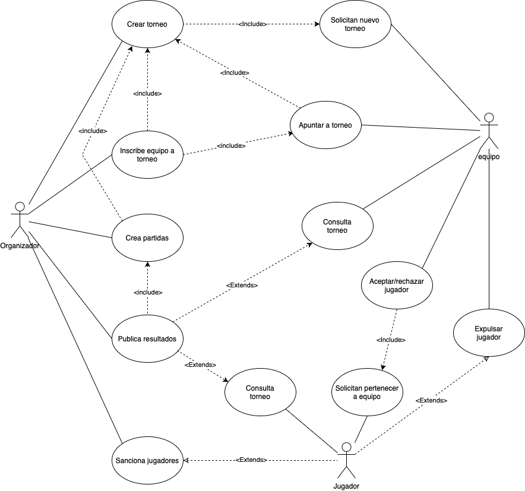
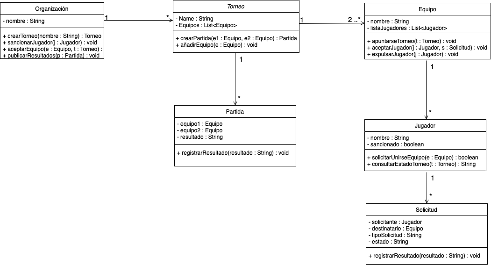

# Sistema de Gestión de Torneos de eSports

## Autor
Marcos González Sánchez
https://github.com/mgonzale42

## Descripción del Proyecto

https://github.com/mgonzale42/torneo-esports-uml.git

Este proyecto implementa un sistema de gestión de torneos de eSports
utilizando UML para el modelado y Java para la implementación.

## Diagramas UML
### Diagrama de Casos de Uso


### Diagrama de Clases


## Estructura del Proyecto
``
torneo-esports-uml/
├── src/ # Código fuente
│ ├── es/empresa/torneo/ # Paquete base del proyecto
│ │ ├── modelo/ # Clases de entidad
│ │ ├── control/ # Clases de control
│ │ ├── vista/ # Clases de interfaz (UI o consola)
│ │ ├── Main.java # Punto de entrada del programa
├── diagrams/ # Diagramas UML
│ ├── casos-uso.png # Diagrama de casos de uso
│ ├── clases.png # Diagrama de clases
├── README.md # Documentación del proyecto
├── .gitignore # Ignorar archivos innecesarios
├── LICENSE (opcional) # Licencia del proyecto
```
or
```
├── src/
│   └── es/
│       └── empresa/
│           └── torneo/
│               ├── modelo/
│               ├── control/
│               ├── vista/
│               └── Main.java
├── diagrams/
│   ├── casos-uso.png
│   └── clases.png
├── README.md
├── .gitignore
└── LICENSE (opcional)
```

## Instalación y Ejecución
1. Clonar el repositorio:
`git clone https://github.com/mgonzale42/torneo-esports-uml.git`

3. Compilar y ejecutar el proyecto:
`cd src javac es/empresa/torneo/Main.java java es.empresa.torneo.Main`

## Justificación del diseño
• ¿Quiénes son los actores que interactúan con el sistema?
    Organización.
    Equipos.
    Jugadores.
• ¿Cuáles son las acciones que cada actor puede realizar?	
    Organización:
        Crear torneos.
        Aceptar inscripciones de equipos a torneos.
        Gestiona torneos (crea emparejamientos, publica resultados).
        Sancionar Jugadores.
    Equipos:
        Aceptar/expulsar jugadores.
        Apuntarse a torneos.
        Solicitar nuevo torneo.
        Consultar el estado de los torneos.
    Jugadores
        Solicitud para entrar a un equipo.
        Consultar el estado de los torneos.


• ¿Cómo se relacionan entre sí las entidades del sistema?
    Organización:
        Gestiona los torneos, cada torneo tendrá que tener 2 o más equipos para poder comenzar.
        Sanciona jugadores.
        Gestiona torneos puede no permitir jugar a equipos por tener jugadores sancionados.
    Equipos:
        Se apuntan a torneos de la organización.
        Solicitan torneos a la organización.
        Acepta, rechaza o expulsa jugadores.
    Jugadores:
        Solicitan participar a los equipos.
        Solicitan a la organización el estado de un torneo.

• Casos de uso:
    - Gestión de equipos:
        Actores implicados:
            Organización.
            Equipos.
        Casos de uso:
            La organización puede aceptar o rechazar la inscripción de un equipo a un torneo.
            Un equipo puede apuntarse a un torneo.
            Un equipo puede aceptar, rechazar o expulsar a un jugador de su plantilla.


    - Gestión de jugadores:
        Actores implicados:
            Organización.
            Equipos.
            Jugadores.
        Casos de uso:
            Un jugador puede solicitar unirse a un equipo.
            Un equipo puede aceptar o rechazar la solicitud de un jugador.
            Un equipo puede expulsar un jugador.
            La organización puede sancionar a los jugadores.

    - Gestión de torneos:
        Actores implicados:
            Organización.
            Equipos.
            Jugadores.
        Casos de uso:
            Un equipo puede solicitar un nuevo torneo a la organización.
            La organización acepta o rechaza un nuevo torneo solicitado por un equipo.
            La organización crea los torneos.
            La organización acepta o rechaza a un equipo.
            La organización crea cada partida.
            La organización publica cada resultado.
            Un equipo puede consultar el estado de un torneo.
            Un jugador puede consultar el estado de un torneo.

## Conclusiones
Sobre el aprendizaje obtenido.
